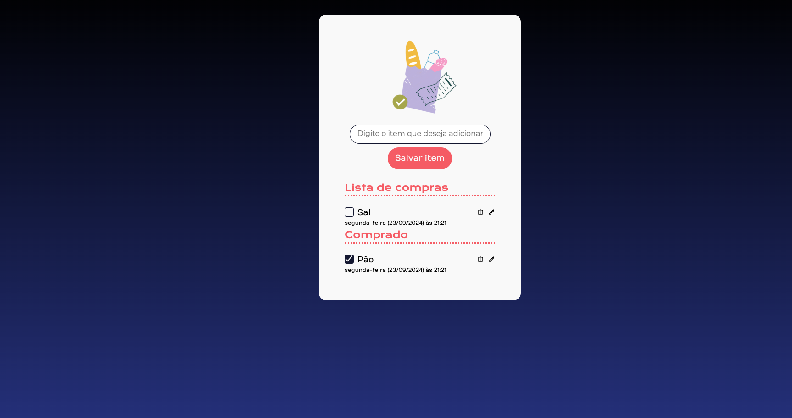

<h1 align="center">
 Lista de compras
</h1>

  <a href="#-tecnologias">Tecnologias</a>&nbsp;&nbsp;&nbsp;|&nbsp;&nbsp;&nbsp;
  <a href="#-projeto">Projeto</a>&nbsp;&nbsp;&nbsp;|&nbsp;&nbsp;&nbsp;

 

  

 

  

## 🚀 Tecnologias

Esse projeto foi desenvolvido com as seguintes tecnologias:

- HTML
- CSS
- JavaScript
- Git e GitHub

## 💻 Projeto

Projeto para simular uma lista de compras, com funções de adicionar, remover, editar e marcar como comprado na lista.

Feito com ♥ by Rafael Paiva :wave:
